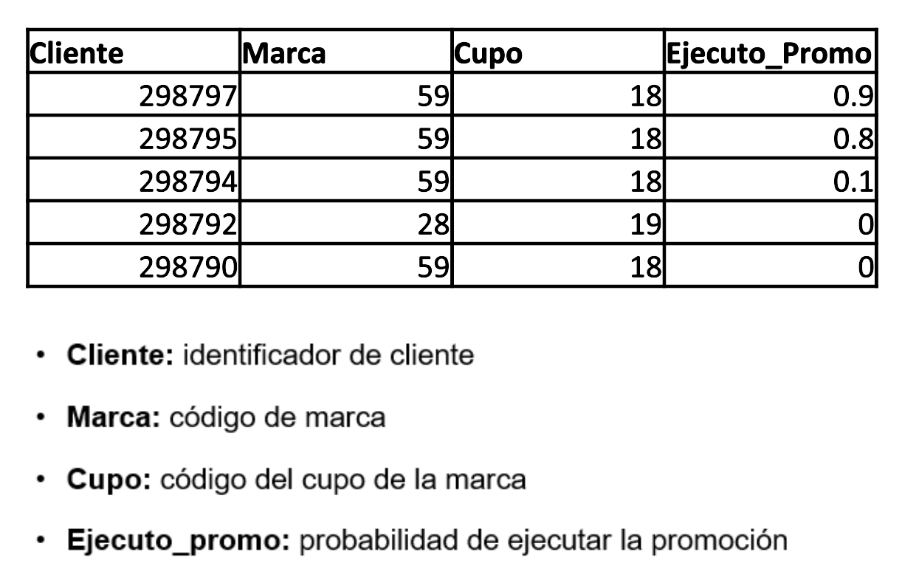

# Reto Perú

En ABInBev queremos optimizar nuestros recursos poniendo el descuento correcto en aquellos clientes que son más propensos a tomarlo. Queremos que demuestres tu capacidad para crear un modelo que estime la probabilidad de que un cliente tome una promoción y así encontrar las mejores promociones en los clientes con mayor probabilidad de adherirse a ellas. 
​

## ¿Qué enviar?

1. El output requerido completo.csv​
2. Código completo de la construcción de la solución (únicamente R o Python – no evaluaremos códigos en software comerciales).link de github​
3. Una presentación a detalle de la metodología usada para resolver el problema, el modelo aplicado,  consideraciones y resultados obtenidos. (Máximo 5 diapositivas).​

